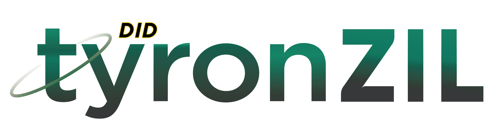

**

{: width="505" loading="lazy"}

**

## SSI Protocol's Decentralized Identifier Method Specification

[Tyron Self-Sovereign Identity Protocol](https://www.ssiprotocol.com)

The user of Tyron is the owner of its immutable, decentralized identity smart contract.

DID dapps:

- [DIDxWallet: decentralized identifier smart wallet](https://github.com/pungtas/smart-contracts.tyron/blob/main/DID/DIDdapps/DIDxWallet.tyron.scilla)
- [INIT.tyron: SSI initialization & DNS smart contract](https://github.com/pungtas/smart-contracts.tyron/blob/main/INIT/init.tyron.scilla)

Smart contracts on Zilliqa get written in [Scilla](https://scilla-lang.org/) (Smart Contract Intermediate-Level Language) that has a design focused on safety, imposing a language structure that makes applications less vulnerable to attacks by eliminating known vulnerabilities directly at the language level.

> Scilla provides formal verification with embedding into the [Coq proof assistant](https://coq.inria.fr/).

The tyronzil DID Method is part of the [W3C DID Specification Registries](https://w3c.github.io/did-spec-registries/) and the first DID Method for the [Zilliqa](https://www.zilliqa.com) blockchain platform, funded by [ZILHive](https://www.zilhive.org) Innovation track.

- Scheme:
      - [DID Scheme](./scheme/did-scheme.md)
      - [DID-URL syntax](./scheme/did-url-syntax.md)

- [DID Document](./did-document.md)

- DID CRUD operations:
      - [Create](./CRUD-operations/did-create.md)
      - [Resolve](./CRUD-operations/did-resolve.md)
      - [Recover](./CRUD-operations/did-recover.md)
      - [Update](./CRUD-operations/did-update.md)
      - [Deactivate](./CRUD-operations/did-deactivate.md)

- [Security & privacy considerations](./security-privacy.md)

- [Parameters](./protocol-parameters.md)

- [Models](./implementation/models.md)

## Conformance

The tyronzil DID Method specification is conformant with the World Wide Web Consortium (W3C) [Decentralized Identifiers (DIDs) v1.0](https://w3c.github.io/did-core/) specification.

- [W3C DIDs terminology](./W3C-dids.md)

The key words "MUST", "MUST NOT", "REQUIRED", "SHALL", "SHALL NOT", "SHOULD", "SHOULD NOT", "RECOMMENDED", "MAY", and "OPTIONAL" in this specification are to be interpreted as described in [RFC 2119](https://tools.ietf.org/html/rfc2119).

Versions get organized by [Semantic Versioning](https://semver.org/).

## Off-chain software

- SSI client for Node.js: [tyronzil](https://github.com/tralcanx/tyronzil)
- JavaScript library: [tyron.js](https://github.com/pungtas/tyron.js)
- React web app: [SSI Browser](https://github.com/Zillacracy-org/ssibrowser.com)
